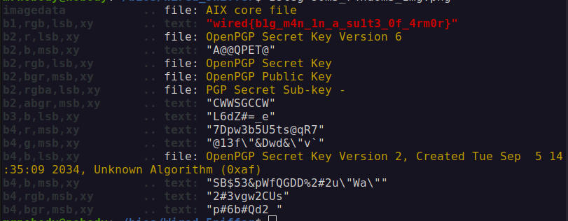

#  
 Wired_5niffer Challenge Write Up

##  Challenge Description
Find the flag from given pcap file

## ✨Solution
### Step 1

The [wireshark](https://www.wireshark.org/)'s Export Object -> HTTP shows us there are totally 3 files transmitted in the given capture. The text file says
`Hey Have you heard about hiding texts inside images????!!!` . So it is definitely image steganography. Luckly we have a PNG file in it.

### Step 2
After a doing lot of tweak in image and trying different tools, I ended up discovering flag when I checked the LSB of the PNG using [Zsteg](https://www.aldeid.com/wiki/Zsteg#Syntax).

  

##  🚩Flag
wired{b1g_m4n_1n_a_su1t3_0f_4rm0r}
