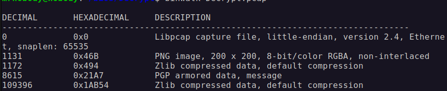
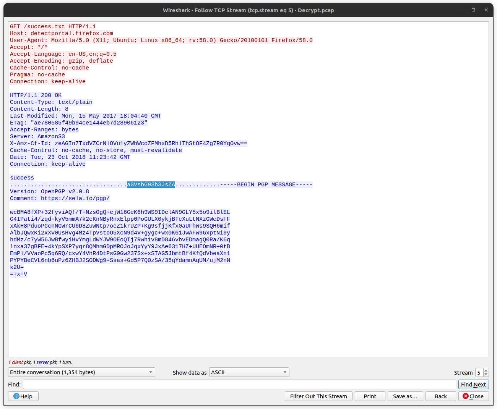
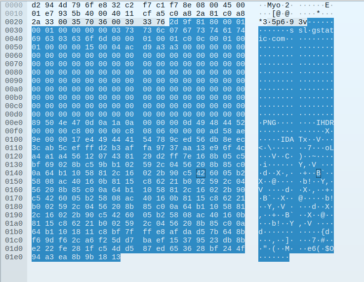
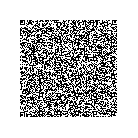
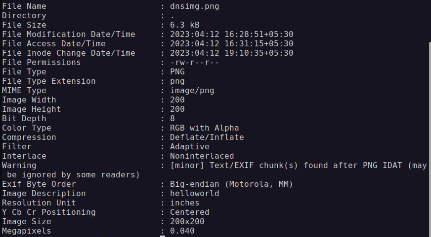

#  
Decrypt Challenge Write Up

##  Challenge Description
Bob and Charlie were sending some messages among themselves,and I planned to intercept their secrecy and get something out of it, 
however they are clever enough 	that no one gets anything. Please help me out to get the secret!!

## ✨Solution
### Step 1

Before start with anything it is always good to gain basic infomation about given file, in our case it is pcap file so. 
[Binwalk](https://en.kali.tools/?p=1634) gave us pcap have png file and PGP message.

  

###  Step 2

There are only 2 packets that uses HTTP protocol. When we observe closely, one IP in inside network and the other is outside the network. 
The packets says IP inside network is Ubuntu in firefox and other one is AWS server so they are potential candidate for Bob and Charlie.
In the first packet, success.txt is send to AWS serve which has no useful information. The 2nd packet has PGP message.
To decrypt this messgae we need a private key and passcode. So now hunt for private key and passcode begins. In the same packet, there is a bunch of 
charecters before the PGP message which has no relevance there so there is  a possibility that might be passcode. It is werid to send passcode and message 
at same time but still a possibility.

  

###  Step 3

So clearly we have identified the receiver IP. Now we filter the packets with receiver IP. There is a lot of TCP handshake going on and lot of TLS 
packets but clearly most of TLS the packets are short to have PGP private key. When we look at the DNS packets, they are long than other dns packets.
They have extra trailer bits. In the first packet it says PNG in the trailer sequence. The first few HEX value is same as PNG header. We have located 
the PNG image what binwalk told us about. We extract the hex data and create a file. It looks like a part of QR code. This is a good lead. 
Now we extract all HEX value in trailer of the filtered packets. These HEX values are cascaded to form a single PNG file. 
This process can be automated using a python script with [scapy](https://scapy.readthedocs.io/en/latest/) library but it I did it using 
[Ghex](https://wiki.gnome.org/Apps/Ghex) manually which is lot of work.
We decrypt QR code in PNG which gives us the PGP private key.

  

  

###  Step 4

To solve the last part of the puzzle we need passcode. At this point, we can use John the Ripper to bruteforce the passcode but it is always good to 
look for it. The charecters obtain in step 2 was use to decypt but not usefull. Then our last resort is is our PNG file. So steganography?? The 
EXIF data of PNG has comment saying `helloworld` . This comment turns out to be the passcode. We can use online decrypter to decrypt PGP message.

  

##  🚩Flag
flag{eNcryP7!ng_t0_PgP_1s_r34LLy_Pre3tY_g00D_pr1V4cY}
