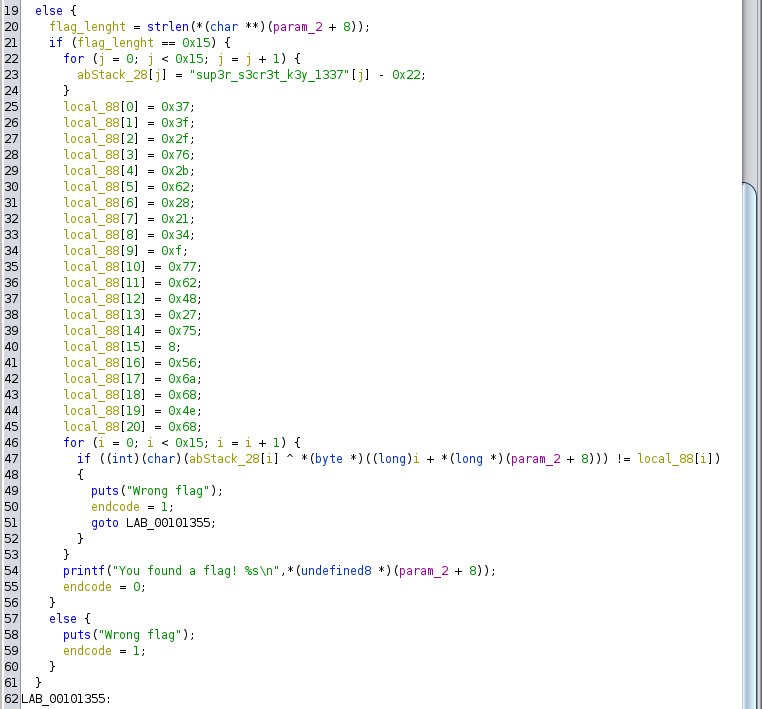

#  <p align="center"> zehr0_rev Challenge Write Up

##  Challenge Description
Here is a firmware dump. Can you find the flag?

## ✨Solution
### Step 1
[Binwalk](https://en.kali.tools/?p=1634) tell us the dump is ELF file from AMD machine that run on linux.
From here onwards it is basic binary reversing.

### Step 2
[Ghidra](https://ghidra-sre.org/) is used to decompile the binary file. The decompiled code tells us that it takes the input from user and perform 
xor operation with binary value that is obtained from ` "sup3r_s3cr3t_k3y_1337"[j] - 0x22` and checks the resultant binary value with locally stored values.
If the above check is staisfied then the input value is the flag. To find the input value we have to reverse the operation. Since it xor operation we can
find the flag by just performing xor operation with those 2 binary values. The following python script does this operation and gives us the flag.
<p align="center">
  
</p>

```python
local_88={}
local_88[0] = 0x37;
local_88[1] = 0x3f;
local_88[2] = 0x2f;
local_88[3] = 0x76;
local_88[4] = 0x2b;
local_88[5] = 0x62;
local_88[6] = 0x28;
local_88[7] = 0x21;
local_88[8] = 0x34;
local_88[9] = 0x0f;
local_88[10] = 0x77;
local_88[11] = 0x62;
local_88[12] = 0x48;
local_88[13] = 0x27;
local_88[14] = 0x75;
local_88[15] = 0x08;
local_88[16] = 0x56;
local_88[17] = 0x6a;
local_88[18] = 0x68;
local_88[19] = 0x4e;
local_88[20] = 0x68;

var1="sup3r_s3cr3t_k3y_1337"
var2=[]
for i in var1:
    var2.append(ord(i)-0x22)
flag=[]
for i in range (21):
    flag.append(local_88[i]^var2[i])
for i in flag:
    print(chr(i),end="")
```
##  🚩Flag
<p>
flag{_y0u_f0und_key_}
</p>
